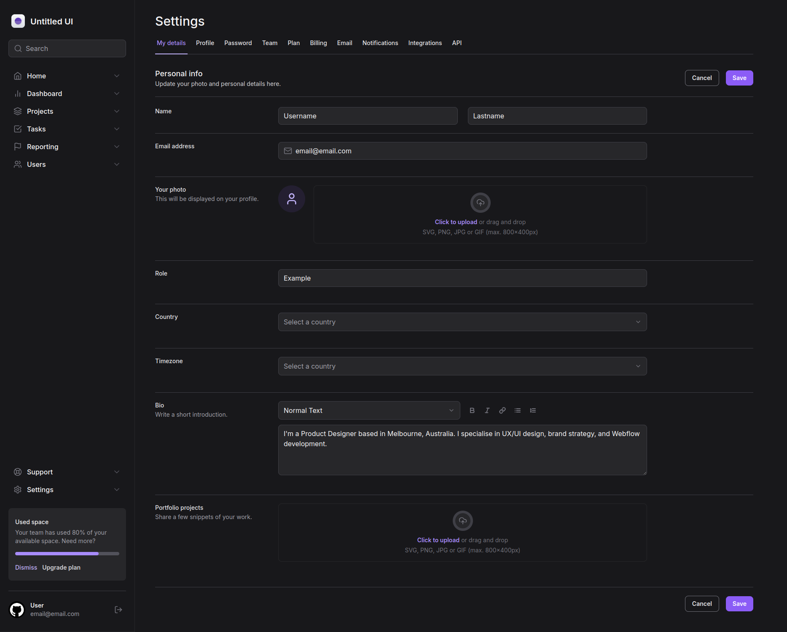

<p align="center">
  <h1 align="center"><a href="https://food-explorer-vasc-333.netlify.app/">Administrative Panel 💻</a></h1>
</p>

> Status: Developed ✅

### Initial page:



## About the project 📝

Building an administrative panel using the RADIX UI library, putting application development into practice with ready-made components.

## Technologies used in this project 🛠️

- [HTML](https://developer.mozilla.org/pt-BR/docs/Web/HTML)
- [CSS](https://developer.mozilla.org/pt-BR/docs/Web/CSS)
- [ReactJS](https://legacy.reactjs.org/docs/getting-started.html)
- [NextJS](https://nextjs.org/)
- [Radix](https://www.radix-ui.com/)
- [TailwindCSS](https://tailwindcss.com/)

## How can I use it? 💻

### 1. Clone the project to your computer.

```bash
$ git clone git@github.com:holices/administrative-panel
```

<br>

### 2. With the project open in an IDE, run the commands:

```bash
# Install the packages needed to run the project
$ npm install
```

```bash
# Run the frontend
$ npm run dev
```

<br>

### 3. Now register on the login screen and you're ready to go! 🎉

<br>

## Thank you in advance for any contribution!
